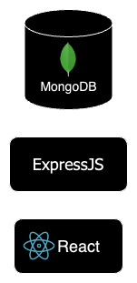

# BlogNest

BlogNest is mainly a test app for deploying to AWS.
It should contain pages for:

- Viewing all blog posts (Home page `/`)
- Viewing a single blog post
- Editing a single blog post
- Creating a blog post

It will be built using the [MERN stack](https://www.mongodb.com/mern-stack):

- MongoDB
- ExpressJS (Data Access API)
- React (Front end)
- NodeJS (the premier JavaScript web server)

## Resources:

- [MERN Stack Explained](https://www.mongodb.com/mern-stack)
- [MongoDB Docs](https://www.mongodb.com/docs/)
- [ExpressJS Docs](https://expressjs.com/en/4x/api.html)
- [ReactJS Docs](https://react.dev/reference/react)
- [NodeJS Docs](https://nodejs.org/docs/latest/api/)
